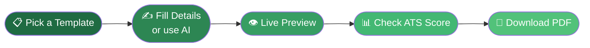

<!-- ===================== HEADER BANNER ===================== -->
<p align="center">
  
</p>


 
 

<!-- ===================== LOGO + TYPING ===================== -->
<div align="center">


<br/>

<a href="https://vignesh2027.github.io/Craftez_my_resume/">
  
</a>

<br/><br/>

<!-- ===================== BADGES ===================== -->
[](https://vignesh2027.github.io/Craftez_my_resume/)
[](LICENSE)
[](#)
[](#)


&nbsp;


</div>

<br/>

<!-- ===================== ANIMATED DIVIDER ===================== -->


## ✨ Why Craftez My Resume?

<table>
<tr>
<td width="50%" valign="top">

### 🎨 170+ Professional Templates
Classic, modern, academic, two-column, photo, and premium one-page designs — a style for every industry.

### 📊 Real-Time ATS Score
A live 30-point checker grades your resume as you type and shows exactly what to fix.

### 🤖 AI Resume Assistant
Describe yourself in one line and watch your entire resume fill itself — summary, experience, skills, and more.

</td>
<td width="50%" valign="top">

### 🔒 100% Private
Everything runs in your browser. No account, no server, no tracking.

### 🎯 Drag-to-Reorder Sections
Rearrange any section live in the preview to craft the perfect layout.

### 📄 Pixel-Perfect Export
Download a crisp, watermark-free PDF or export to Word in one click.

</td>
</tr>
</table>


## 🚀 Features at a Glance

```text
✓ Live Preview            ✓ ATS File Checker (PDF/DOCX upload)
✓ 28 Color Themes         ✓ Cover Letter Builder + Signature
✓ Academic CV Formats     ✓ Smart Summary Writer
✓ Installable PWA         ✓ Fully Responsive (desktop / mobile)
✓ Offline Support         ✓ Zero Watermarks · Zero Signup
```


## 🛠️ Built With

<p align="center">
  
</p>

<div align="center">

| Layer | Technology |
|:-----:|:----------:|
| **Frontend** | Vanilla HTML5 · CSS3 · JavaScript (ES6+) |
| **PDF Export** | html2pdf.js |
| **Doc Parsing** | PDF.js |
| **Storage** | Browser localStorage — 100% client-side |
| **Hosting** | GitHub Pages |
| **App Type** | Progressive Web App (Service Worker + Manifest) |

</div>

> ⚡ **Zero backend. Zero install. Just open and build.**


## 📦 Quick Start

```bash
# Clone the repository
git clone https://github.com/vignesh2027/Craftez_my_resume.git
cd Craftez_my_resume

# Serve locally (any static server works)
python3 -m http.server 8000

# Open in your browser
open http://localhost:8000
```

No build step. No `npm install`. It just works.


## 🎯 How It Works

<div align="center">



</div>


## 📁 Project Structure

```
Craftez_my_resume/
├── 📄 index.html          # Landing page + ATS checker
├── 🛠️ form.html           # Resume builder (the core app)
├── ✉️ cover.html          # Cover letter builder
├── 🎨 style.css           # Global styles
├── ⚙️ script.js           # Builder logic, preview, ATS scoring
├── 🤖 ai.js               # AI assistant module
├── 📂 templates/          # 170+ resume template files
├── 🖼️ logo.png            # Brand logo
├── 📱 manifest.json       # PWA manifest
└── 🔌 service-worker.js   # Offline support
```


## 📸 Template Categories

<div align="center">

| 🏆 Premium Picks | ✅ ATS Pro | 📐 Classic |
|:---:|:---:|:---:|
| Best one-page designs | Recruiter-system optimized | Timeless formats |
| **🖼️ Photo** | **🎓 Academic / CV** | **🎨 Creative** |
| Clean profile-photo layouts | Research & education focused | Stand-out modern styles |

</div>


## 👤 Author

<div align="center">

**Vignesh S**

[](https://github.com/vignesh2027)

</div>

## 📄 License

Licensed under the **MIT License** — see [LICENSE](LICENSE) for details.

<br/>

<!-- ===================== FOOTER ===================== -->
<p align="center">
  
</p>

<div align="center">

### ⭐ If this helped you land an interview, give it a star!

**[Try Craftez My Resume →](https://vignesh2027.github.io/Craftez_my_resume/)**

</div>
